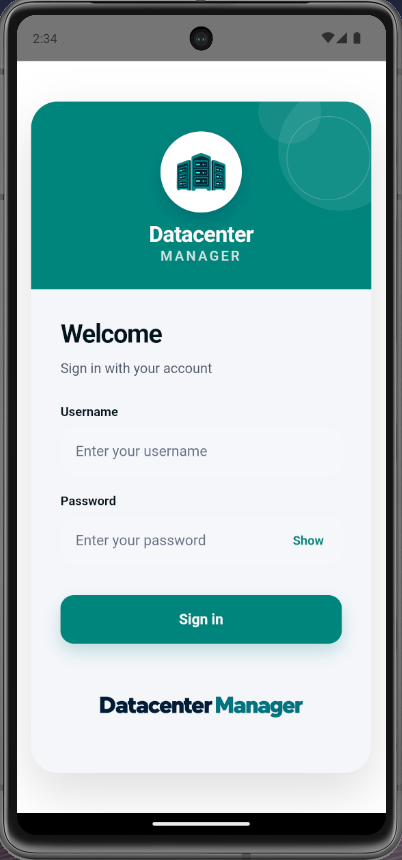
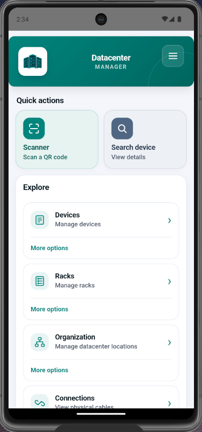
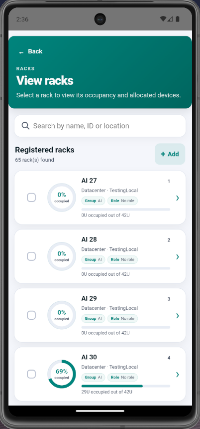
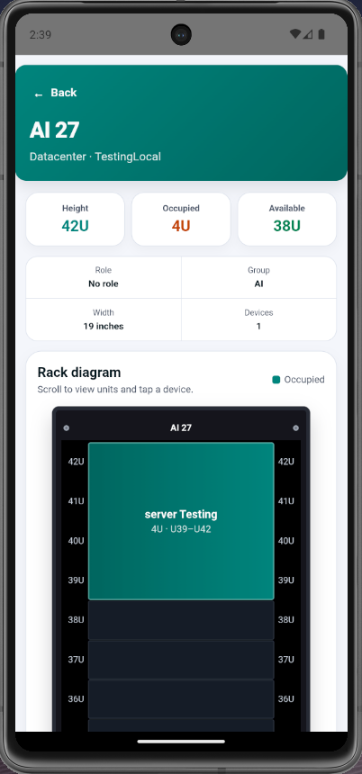

# Datacenter Manager

[English](README.md) | **Português (Brasil)**

Datacenter Manager é um projeto open source independente voltado à comunidade, para consultar e gerenciar infraestrutura de datacenter pelo navegador ou pelo Android. Integra-se à API REST do **[NetBox](https://netboxlabs.com/products/netbox/)** para trabalhar com equipamentos, racks, sites, locais, regiões e conexões físicas.

Os dados são consultados e atualizados diretamente na sua instância do NetBox, respeitando as permissões do usuário autenticado. **O inglês é o idioma padrão da interface**; o português do Brasil também está disponível em **Home → menu → Languages**, com a escolha salva no dispositivo. Em português, a opção aparece como **Linguagens**.

Este projeto é um cliente móvel independente do NetBox. Não é um produto oficial do projeto NetBox nem da NetBox Labs. Para configurações avançadas e operações fora do escopo do aplicativo, utilize a interface web do NetBox.

## Status

**Em desenvolvimento.** O projeto possui interface web em React e projeto Android integrado com Capacitor, além de testes automatizados com Vitest. As funcionalidades disponíveis estão descritas abaixo; o pacote frontend se chama `datacenter-manager` e sua versão atual é `0.0.0`.

## Funcionalidades

- **Autenticação e permissões:** login com usuário e senha do NetBox, controle de acesso por ação e identificação de sessões somente para leitura.
- **Equipamentos:** listagem paginada, busca por nome ou patrimônio, cadastro, consulta de detalhes, edição e exclusão conforme as permissões.
- **Catálogos de equipamentos:** consulta, cadastro e exclusão de fabricantes, tipos e funções.
- **QR Code:** leitura pela câmera para localizar equipamentos e geração de códigos para salvar como imagem.
- **Campos personalizados:** exibição e edição conforme as definições e validações cadastradas no NetBox.
- **Racks:** listagem, cadastro e exclusão, gestão de grupos e funções, além de visualização da ocupação e dos equipamentos no desenho do rack.
- **Organização:** consulta, cadastro e exclusão de sites, locais e regiões.
- **Conexões físicas:** consulta de cabos, detalhes das terminações e diagrama de conexão, além do cadastro de conexões conforme as permissões.
- **Uso no navegador e no Android:** frontend web e empacotamento como APK com Capacitor.
- **Inglês e português:** troca de idioma pelo menu da home, sem recarregar o aplicativo.

## Exemplos visuais

Capturas do aplicativo disponíveis na pasta [`fotos_do_projeto`](fotos_do_projeto/). Elas ilustram os fluxos e podem mostrar uma versão anterior da identidade visual.

<table>
  <tr>
    <th>Login</th>
    <th>Tela inicial</th>
  </tr>
  <tr>
    <td></td>
    <td></td>
  </tr>
  <tr>
    <th>Listagem de racks</th>
    <th>Detalhes e ocupação do rack</th>
  </tr>
  <tr>
    <td></td>
    <td></td>
  </tr>
</table>

## Tecnologias

| Tecnologia | Utilização |
| --- | --- |
| React 19 | Interface e componentes |
| TypeScript 6 | Tipagem do frontend e da integração |
| Vite 8 | Servidor de desenvolvimento e build |
| Capacitor 8 | Integração do frontend com o Android |
| NetBox REST API | Dados, autenticação e permissões |
| Zod 4 | Validação de entradas e respostas da API |
| jsQR e qrcode | Leitura e geração de QR Codes |
| CSS | Estilos e layout responsivo |
| Vitest e jsdom | Testes automatizados |
| Oxlint | Análise estática do código |
| Gradle e Android SDK | Compilação do aplicativo Android |

## Pré-requisitos

Para executar no navegador:

- **Node.js 22.12 ou superior** e npm, atendendo às exigências das dependências do projeto.
- Uma instância do **NetBox** com API REST acessível, provisionamento de tokens e endpoint `/api/authentication-check/` disponíveis.
- Usuário do NetBox com permissões para os objetos que pretende consultar ou modificar.
- CORS do servidor configurado para permitir a origem do frontend.
- Para leitura de QR Code, câmera disponível e permissão de acesso. No navegador, use HTTPS ou `localhost` para acessar a câmera.

Para compilar e executar no Android, também são necessários:

- **Android Studio**, **Android SDK 36** e **JDK 21**.
- SDK configurado no ambiente ou em `app/android/local.properties`.
- Emulador ou aparelho com **Android 7.0 (API 24) ou superior**.
- Android SDK Platform-Tools (`adb`) para instalação pelo terminal.

## Instalação e execução

### Navegador

Clone o repositório e entre na pasta `app/`:

```bash
git clone https://github.com/luisfilippe650/netbox-mobile.git
cd netbox-mobile/app
npm ci
cp .env.example .env.local
```

Edite `.env.local` conforme a seção [Configuração](#configuração) e inicie o servidor:

```bash
npm run dev
```

Abra o endereço exibido pelo Vite no terminal, normalmente `http://localhost:5173`, e entre com suas credenciais do NetBox. O servidor NetBox deve estar em execução separadamente.

### Build web

Configure uma API **HTTPS** antes de gerar o build de produção:

```bash
npm run build
npm run preview
```

O build é gerado em `app/dist/`. O comando `preview` permite conferir localmente o resultado.

### APK Android de teste

Dentro de `app/`, gere o frontend de desenvolvimento, sincronize o Capacitor e compile o APK:

```bash
npm run android:build:debug
```

Para usar o NetBox do computador no emulador padrão do Android Studio, em Bash/Linux/macOS:

```bash
VITE_NETBOX_API_URL=http://10.0.2.2:8000/api npm run android:build:debug
```

O APK será gerado em `app/android/app/build/outputs/apk/debug/app-debug.apk`. Para instalar no aparelho ou emulador conectado, ainda dentro de `app/`:

```bash
adb devices
adb install -r android/app/build/outputs/apk/debug/app-debug.apk
```

Havendo vários dispositivos conectados, selecione o destino com `adb -s SERIAL install -r ...`.

Para um emulador ou Android conectado por USB que utilize `http://localhost:8000/api` no aplicativo, você pode encaminhar a porta:

```bash
adb reverse tcp:8000 tcp:8000
```

Esse encaminhamento depende da conexão ADB ativa; configure-o novamente caso a conexão seja perdida. O APK contém o frontend e não precisa do Vite aberto, mas continua dependendo de acesso à API do NetBox.

### Android de produção

Configure uma API HTTPS e execute, dentro de `app/`:

```bash
npm run android:sync
npx cap open android
```

No Android Studio, use **Build > Generate Signed App Bundle or APK** para gerar a variante **release** assinada. Guarde a chave de assinatura fora do repositório para utilizá-la nas futuras atualizações.

A plataforma Android já está incluída no projeto. Após alterar o frontend ou as variáveis de ambiente, sincronize, gere e instale novamente o APK.

### Verificações do projeto

Dentro de `app/`:

```bash
npm run lint
npm test
```

## Configuração

O arquivo [`app/.env.example`](app/.env.example) contém um guia detalhado. Use uma cópia local em `app/.env.local`:

```env
VITE_NETBOX_API_URL=http://localhost:8000/api
VITE_NETBOX_REQUEST_TIMEOUT_MS=15000
```

| Variável | Descrição |
| --- | --- |
| `VITE_NETBOX_API_URL` | URL absoluta da API REST do NetBox, incluindo `/api`. Obrigatória. |
| `VITE_NETBOX_REQUEST_TIMEOUT_MS` | Tempo limite de cada requisição, em milissegundos. Padrão: `15000` (15 segundos). |

### Endereço da API por ambiente

| Ambiente | Exemplo de URL |
| --- | --- |
| Navegador no computador do NetBox | `http://localhost:8000/api` |
| Emulador padrão do Android Studio | `http://10.0.2.2:8000/api` |
| Celular físico na mesma rede | `http://192.168.1.20:8000/api` |
| Produção web ou Android | `https://netbox.empresa.com/api` |

Substitua os endereços de exemplo pelos do seu servidor. No Android, `localhost` aponta para o próprio dispositivo, exceto quando o encaminhamento de porta pelo ADB está configurado. O IP usado deve estar acessível pelo Wi-Fi ou VPN, com a porta liberada no servidor.

HTTP é permitido nos fluxos de desenvolvimento e no APK debug. Builds de produção exigem HTTPS; a variante Android release bloqueia tráfego HTTP.

### CORS e permissões no NetBox

Configure no servidor as origens realmente utilizadas pelo frontend, sem acrescentar `/api`:

- Desenvolvimento web: `http://localhost:5173`, ou a origem exibida pelo Vite.
- APK debug: `http://localhost`.
- APK release: `https://localhost`.
- Site publicado: a origem HTTPS do seu site.

As permissões são verificadas por tipo de objeto e pelas ações `view`, `add`, `change` e `delete`. Conceda também leitura dos objetos relacionados necessários aos formulários, como sites, racks, tipos e funções ao cadastrar um equipamento. O NetBox continua responsável pela autorização efetiva das operações.

### Ambiente e sessão

- Reinicie o Vite após alterar os arquivos de ambiente. Para o Android, gere e instale novamente o APK.
- Arquivos específicos de modo, como `.env.production.local`, podem sobrescrever `.env.local`; variáveis definidas no terminal têm prioridade.
- Variáveis `VITE_` são incorporadas ao frontend. Configure apenas os dados públicos de conexão; usuário e senha são informados na tela de login.
- No navegador, o token permanece em memória. No Android, a sessão é persistida de forma protegida com Android Keystore. Ao sair, o aplicativo tenta revogar o token no NetBox e limpa a sessão local.


## Documentação

A documentação do projeto usa [Zensical](https://zensical.org/docs/) e fica em [`docs/`](docs/index.md), em [português](docs/index.md) e [inglês](docs/en/index.md), com navegação definida em [`zensical.toml`](zensical.toml). Requer Python 3.10 ou superior com `venv` e `pip`.

Na raiz do repositório, em Bash/Linux/macOS:

```bash
python3 -m venv .venv-docs
source .venv-docs/bin/activate
python -m pip install -r requirements-docs.txt
zensical serve
```

Abra `http://127.0.0.1:8001`. No Windows, ative o ambiente com `.venv-docs\Scripts\activate` no Prompt de Comando. Para gerar o site estático:

```bash
zensical build --strict
```

O resultado fica em `site/`. Edite as páginas Markdown em `docs/` e atualize a navegação ao adicionar páginas. O build, o cache e o ambiente Python local são ignorados pelo Git.

## Desenvolvimento e origem

Desenvolvido por **[Luis Filippe Reis Nogueira](https://github.com/luisfilippe650)**, no contexto de suas atividades de estágio na **Divisão de Infraestrutura de Dados e Supercomputação (COIDS)**, do **[INPE — Instituto Nacional de Pesquisas Espaciais](https://www.gov.br/inpe/pt-br)**.

O projeto surgiu das necessidades de gerenciamento de datacenter, com o objetivo de tornar a consulta e a atualização das informações de infraestrutura mais práticas e acessíveis pelo celular. Esta versão voltada à comunidade disponibiliza o código-fonte para colaboração e evolução do projeto.

## Créditos e integração com o NetBox

O Datacenter Manager utiliza a API REST do NetBox para sua integração com o backend. Os créditos pela plataforma de infraestrutura, pelas APIs e pela documentação que tornam essa integração possível pertencem à **comunidade e aos mantenedores do NetBox**.

- [Site do NetBox](https://netboxlabs.com/products/netbox/)
- [Código-fonte e comunidade do NetBox](https://github.com/netbox-community/netbox)
- [Documentação do NetBox](https://netboxlabs.com/docs/netbox/)
- [NetBox Labs](https://netboxlabs.com/)

O NetBox é um projeto separado, com licença e mantenedores próprios. O Datacenter Manager não é um aplicativo oficial do projeto NetBox nem da NetBox Labs. As bibliotecas de terceiros mantêm suas respectivas licenças e créditos.

## Como contribuir

Contribuições, relatos de problemas, melhorias na documentação e traduções são bem-vindos.

1. Abra uma [issue](https://github.com/luisfilippe650/netbox-mobile/issues) descrevendo o problema ou a melhoria proposta. Para bugs, inclua os passos de reprodução e as versões relevantes do navegador, Android e NetBox.
2. Faça um fork do [repositório](https://github.com/luisfilippe650/netbox-mobile) e crie uma branch para sua alteração.
3. Faça alterações focadas, atualize as duas versões do README quando necessário e execute `npm run lint` e `npm test` dentro de `app/`.
4. Envie um [pull request](https://github.com/luisfilippe650/netbox-mobile/pulls) explicando a alteração e como ela foi verificada.

Não inclua credenciais, tokens ou dados privados de infraestrutura em issues, capturas de tela ou commits.

## Licença

Ainda não foi adicionado um arquivo de licença a este repositório. A licença do Datacenter Manager permanece a definir e é independente das licenças do NetBox e das demais dependências.
